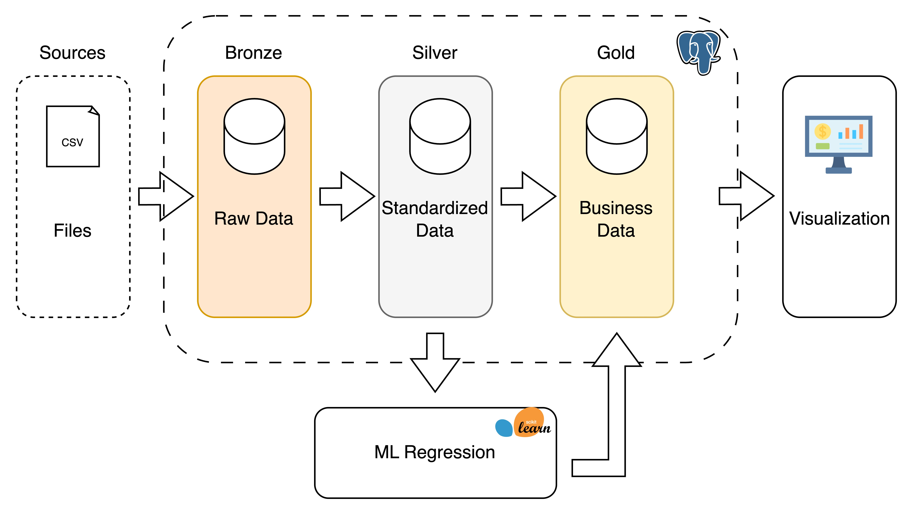

# End-To-End-ML-pipeline-for-profiling-insurance-customers

## Data Warehouse
This project implements a comprehensive machine learning pipeline for profiling insurance customers. We designed and built a data warehouse using the Medallion architecture (Bronze, Silver, Gold layers) to ensure robust data ingestion, transformation, and analytics. The Medallion schema enables scalable, reliable, and maintainable data workflows, supporting the end-to-end ML lifecycle from raw data collection to advanced modeling and reporting.



-------- 
## Project Organization

```
├── LICENSE            <- Open-source license 
├── Makefile           <- Makefile with convenience commands like `make data` or `make train`
├── README.md          <- The top-level README 
├── data
│   ├── processed      <- The final, canonical data sets for modeling.
|   ├── interim        <- intermediate data
│   └── raw            <- The original, immutable data dump.
│
├── docs               <- A mkdocs project; see www.mkdocs.org for details
│
├── models             <- Trained and serialized models, model predictions, or model summaries
│
├── notebooks          <- Jupyter notebooks. Naming convention is a number (for ordering),
│                         the creator's initials, and a short `-` delimited description, e.g.
│                         `1.0-jqp-initial-data-exploration`.
│
├── pyproject.toml     <- Project configuration file with package metadata for 
│                         policyML and configuration for tools like black
│
├── references         <- Data dictionaries, manuals, and all other explanatory materials.
│
├── reports            <- Generated analysis as HTML, PDF, LaTeX, etc.
│   └── figures        <- Generated graphics and figures to be used in reporting
│
├── requirements.txt   <- The requirements file for reproducing the analysis environment, e.g.
│                         generated with `pip freeze > requirements.txt`
│
│
└── policyML   <- Source code for use in this project.
    │
    └── __init__.py             <- Makes policyML a Python module

```

--------